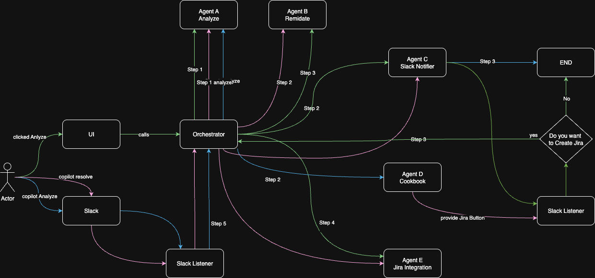

# Smart DevOps Copilot

Multi-agent Python system to: **read logs → recommend fixes → send notification to Slack → create a JIRA ticket**

## LOOM VIDEO URL
https://www.loom.com/share/341a981a9e4a4c4e99676576f22213fa

## Quick Start (Dev)
### 1) Create & activate a venv (optional)
```bash
python3 -m venv .venv
source .venv/bin/activate  # Windows: .venv\Scripts\activate
```

### 2) Install deps
```bash
pip install -r requirements.txt
```

### 3) copy .env file
```bash
cp dummy.env .env
```

### 4) Start the backend (FastAPI)
```bash
uvicorn backend.core.app:app --reload --port 8000
```

### 5) Start the UI (Streamlit)
```bash
streamlit run ui/app.py
```

### 6) Stop the unicorm, if Ctrl + C doesnot work
```bash
lsof -i :8000
kill -9 PID
```

Open the Streamlit URL it prints (usually http://localhost:8501).

## What’s inside
- **Agent A**: Log reader & classifier → extracts fields and categorizes (IAM / Throttling / Timeout / Quota / Config / Scaling / cookbook).
- **Agent B**: Maps category → remediation options with rationale.
- **Agent C**: Sends **Notifications** with proposed Solutions to **Slack**.
- **Agent D**: Cookbook synthesizer, which generate user friendly checklist from json file
- **Agent E**: Jira Ticket Creator, create a Jira ticket if user requiress it
- **Orchestrator**: Langgraph orchestrator with complex flow as mentioned in below diagram



## Demo flow
1. In the UI, upload a sample log from `fixtures/` (or paste).
2. Press **Analyze**.
3. See: A notification in Slack Channel
4. Copy the snippet and validate/apply in your own environment (not part of this demo).


## Project Layout
```
backend/
  agents/
    agent_a_reader.py
    agent_b_remediator.py
    agent_c_slack.py
    agent_d_runbooksynthesizer.py
    agent_e_jira.py
  core/
    orchestrator.py
    app.py
fixtures/
  <8 sample log files>
ui/
  app.py             # Streamlit
docs/
  DESIGN.md
tests/
  test_fixtures.py
requirements.txt
```

## Notes
- **Safety**: Codegen avoids destructive actions. Review all outputs.
- **Auth**: None for hackathon.

## License
MIT
